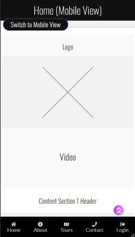
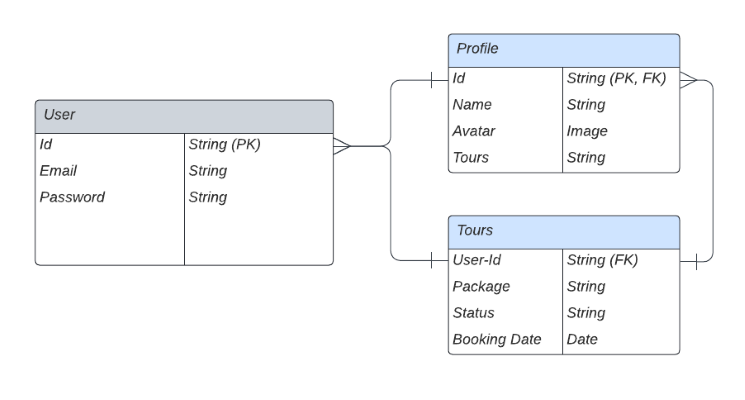
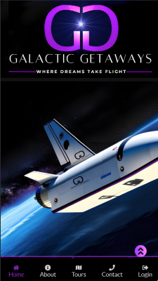

# Galactic Getaways
## Beyond the Horizon
------------------------------------

### Live site available [here](). 

-----

## Table of Contents
--------------------------------------

- [Project Specification](#project-specification)
- [Design](#design)
- [Web Marketing](#web-marketing)
- [Features](#features)
- [Project Planning](#project-planning)
- [Testing](#testing)
- [Technologies](#technologies)
- [Deployment](#deployment)
- [Credits](#credits)
- [Author Info](#author-info)

------

## Project Specification

The Galactic Getaways PWA project was built with the aim not only to build a cutting-edge web app but to gain insights into the world of programming and the business of developing digital solutions.
The decision to build this project in particular was driven by a combination of factors, including the growing interest in space exploration, the untapped potential of space tourism, and the desire expand our own skills in the area of Web Development.

#### Problem Statement
The space tourism industry has traditionally been exclusive, limited to a privileged few with access to astronomical budgets. Galactic Getaways seeks to address this issue by democratizing space travel and making it accessible to a broader audience. This project aims to break down barriers and offer an inclusive platform where enthusiasts and adventurers from all walks of life can embark on thrilling space journeys.

#### Market Size and Opportunity
The market for space tourism holds immense potential, with a growing number of individuals expressing interest in exploring outer space. As technological advancements make space travel more feasible, the demand for such experiences is expected to surge in the coming years. While the space tourism industry is still in its early stages, it is projected to expand rapidly, presenting a significant business opportunity.

#### Target Audience

- Space Enthusiasts: Individuals with a passion for astronomy and space exploration seeking an immersive experience of celestial wonders.

- Adventurers: Those eager to venture beyond Earth's atmosphere, embracing the excitement and challenges of space travel.

- Science and Technology Enthusiasts: Individuals intrigued by the scientific and technological aspects of space missions.

#### Key Features and Functionality
To cater to the needs and expectations of its target audience, the Galactic Getaways web app will include the following essential features:

- User Registration and Authentication: A secure and straightforward registration process to create personalized user profiles.

- Tours Catalog: A catalog showcasing a diverse range of space travel packages, accompanied by high quality imagery and information.

- Booking System: An intuitive booking system that enables users to select their preferred space travel packages and make bookings/enquiries.

- User Profile and Booking History: A dedicated user profile section where travelers can manage their bookings and access their travel history.

#### Technical Requirements
The development of the Galactic Getaways web app will be carried out using the following technologies and frameworks:

- Front-end: HTML5, CSS3, JavaScript, React.js for a dynamic and responsive user interface.

- Back-end: Node.js and Google Firebase for server-side development and handling of API requests.

- Database: Firebase NoSql Database to store user profiles, booking information, and space destination data securely.

- Authentication: Integration of a Google authentication system to safeguard user data.

- Hosting: Cloud-based hosting infrastructure to ensure scalability and reliability.

#### Conclusion
Throughout the project, the team embraced Agile methodology, using Google Firebase for media storage, database management, and login authentication. The Agile approach fostered effective collaboration, enabling the team to address challenges promptly and make improvements.

Hosting the app on Vercel ensured seamless performance and scalability.

Market research provided a deeper understanding of the space tourism industry, revealing the potential for innovation and inclusivity. The emphasis on personalization, safety, and community engagement underscored the importance of user-centric design and building trust with the audience.

[Back to the Top](#table-of-contents)

---------------------------------------

## Design
-------

#### Wireframe mock-ups
---
Home page: 

The home page provides the user with a clear understanding as to the purpose of the site. 

The welcome message is clearly visible to the user when they first arrive at the site regardless of the device they are using.

Tour Page:

Users have the ability to view information on available products and Book a tour. 

The emphasis of the design is to provide a clear layout that can adapt to any size device.

About Page:

Users can view a page dedicated to the company and it's goals, this page includes basic information and photos.

Contact Page:

Users can navigate to the contact page and reach out to the company.

Account/Sign in Page:

Users can create accounts, sign in and see their saved details.

[Back to the Top](#table-of-contents)

---
#### Database Schema

Several custom models were predicted to be required when building the site. These included a User Account/Profile Model and a Tour bookings Model linked to the user account.

[Back to the Top](#table-of-contents)

---

## Web Marketing

#### Marketing Strategy
Our marketing objectives are ambitious yet achievable. Over the next year, we aim to:

- Increase brand awareness and recognition among our target audience by 50%.
- Generate a 30% increase in website traffic through engaging content marketing and social media campaigns.
- Achieve a conversion rate of 20% on space travel package bookings.
- Secure media coverage in leading science and travel publications, reaching a potential audience of 1 million readers.

#### Exploring the Infinite Market Potential
The market for space tourism is rapidly expanding, driven by the increasing interest in space exploration and the allure of experiencing weightlessness and breathtaking views. Our research shows that adventure seekers, science enthusiasts, and affluent individuals are the primary target audience for space travel experiences. With advancements in technology and space infrastructure, the demand for these unparalleled journeys is expected to soar in the coming years. 

The global space tourism market is projected to reach $1.7 billion by 2027, growing at a CAGR of 16.6% from 2020 to 2027. The market is expected to be driven by the increasing number of space exploration missions and the growing investments in space tourism.

#### Competitor Analysis
Redefining Space Tourism, Setting Ourselves Apart
While the space tourism industry is becoming competitive, Galactic Getaways stands out as a pioneer in providing comprehensive and unforgettable space travel adventures. Unlike competitors, our tours offer an extended orbit around the Earth, allowing customers to view iconic landmarks from space. Furthermore, our exclusive partnership with leading space agencies allows for a seamless docking experience with the ISS, making Galactic Getaways the preferred choice for discerning travelers seeking a truly exceptional journey.

#### Unique Selling Proposition (USP)
Galactic Getaways USP lies in its commitment to delivering unparalleled space adventures that go beyond typical space tourism. With our technologically advanced spacecraft and expertly curated itineraries, customers can immerse themselves in the wonders of space travel like never before. Our focus on safety, sustainability, and educational opportunities distinguishes us as the leading space tourism provider for the next generation of explorers.

#### Search Engine Optimization
SEO research is key to driving traffic from a browser based search i.e. Google to the website. The keyword research has played a crucial role in incorporating words that users typically search for when seeking to purchase art online. To help improve the search engine ranking I ensured the site carries meta tags for a description and keywords which encapsulate the general content and focus of this B2C site.

#### XML Sitemap
Additionally to help the search engines crawl the website, We've added an XML sitemap file to the main root directory. The file was created using the free service through XML-Sitemaps.com. A sitemap is a way of organizing a website, identifying the URLs and the data under each section, Allowing search engines to find the data faster and more efficiently.

A robots.txt file has also be included in the build to tell the search engine crawlers which URLs the crawler can access on this site. This is used mainly to avoid overloading the site with requests.

[Back to the Top](#table-of-contents)

---

## Features

#### Home page
A welcoming homepage was built to clearly convey the sites purpose. The call to action buttons for the user to go straight to the tours or contact section is at the bottom of the main page.

#### Navigation Bar
The main navigation bar appears at the bottom of the page, clearly displaying the main navigational links users would require.

#### Other Pages/Features

[Back to the Top](#table-of-contents)

---

## Project Planning

#### Project Overview
Galactic Getaways is a fictional space tourism business aiming to provide users with an immersive web application experience that allows them to explore and book space travel packages. The project was carried out by a team of two developers using Agile methodology, with weekly Sunday evening meetings over a span of four weeks.

##### Week 1: Sprint Planning Meeting
During the first week, we held a sprint planning meeting to establish the project's scope, goals, and define the initial set of features to be implemented. The product backlog was created, consisting of features such as:

- User Registration and Authentication: Allow users to sign up and log in securely to access personalized features.

- Space Destination Catalog: Display a catalog of available space destinations with images and detailed descriptions.

- Booking Functionality: Enable users to select and book their preferred space travel packages.

- User Profile and Booking History: Provide users with a profile section to manage bookings and view their travel history.

Progress:
During this initial phase, we successfully set up the project's development environment and version control system. Basic user registration and login functionality were implemented, laying the groundwork for future features.

##### Week 2: Sprint Review and Retrospective
The second week began with a sprint review to evaluate the progress made and discuss any adjustments needed to meet the project's goals. The following features were the focus of this sprint:

- Connecting the API for displaying the globe and pinpointing the ISS.

- Responsive Design: Ensure the web app is responsive and optimized for various devices.

Progress:
During this sprint, we successfully got the ISS API connected and started with a basic map as proof of concept. Additionally, we implemented a responsive design, ensuring a seamless user experience across different devices.

Setbacks:
We encountered some issues with combining the map with a 3d Globe, which required additional testing and debugging. Despite this challenge, they were able to resolve the issues and proceed with the project.

##### Week 3: Mid-Point Check-in
The third week involved a mid-sprint check-in to assess the progress and discuss any issues.

Progress:
During this phase, we divided up the work to be done on the documentation and made a start on piecing together our report.

##### Week 4: Final Sprint and Project Conclusion
The final week involved intense focus on completing the remaining features and conducting comprehensive testing for a bug-free experience. The feature targeted for this sprint were:

- Error Handling and Security: Ensure robust error handling and implement security measures to safeguard user data.

Progress:
During the last sprint, We addressed security concerns, ensuring data protection throughout the application.

Setbacks:
The final week experienced minimal setbacks, primarily involving minor UI glitches and issues related to handling edge cases. These were promptly fixed during thorough testing.

Project Conclusion:
Despite facing a few challenges along the way, the team successfully completed the web app for Galactic Getaways within the allocated four-week timeframe. Through Agile methodology, they were able to adapt to changing requirements and prioritize features effectively.

[Back to the Top](#table-of-contents)

---

## Testing

### Testing Strategy
We utilized a manual testing strategy for the development of the site.
Separate to the functionality testing of the site, and the testing of the code, User Story tests were implemented to ensure that the criteria of the user stories listed above were met.

#### Validator Testing
All code files were validated using suitable validators for the specific language.
HTML, CSS & JavaScript code passed the validation.

All validation screenshots are included below.

All HTML validation returned the same result so I have included only 1 screenshot here.
## HTML

## CSS

## JS

## JS

## JS

#### Lighthouse Testing
Below you can see the results of Googles Lighthouse Testing.

#### React/JavaScript Testing
All Custom React & JavaScript code was manually tested multiple times during and after development.
This is reflected in the fact that all of the functionality is working.

[Back to the Top](#table-of-contents)

-----

## Technologies

* JavaScript
    * Custom JavaScript was utilized to allow Users to close site messages and increment/decrement cart items.
* React
    * React was used to create the frontend of the site.
* CSS
    * Custom css was written for a large number of areas on the site to implement custom styling and escape a bootstrap look and feel to the site.
* HTML
    * HTML was used as the base language for the templates created for the site.

#### Packages & Libraries Used

* VS Code was used to develop the site
* Git was utilized for version control and transferring files between the code editor and the repository
* GitHub was utilized for storing the files for this project
* EmailJs was used to send emails from the contact form
* 3JS was used to create the 3D globe on the Tours page
* Cloudinary was used to store the images for the site
* Firebase was used to store the database for the site, this included the user accounts and the tour bookings. 
* Vercel was used to deploy the site

"More to come"

[Back to the Top](#table-of-contents)

----

## Deployment

"To be filled in"

#### Forking the repository
By forking the GitHub Repository you can make a copy of the original repository to view or change without it effecting the original repository
This can be done by
* Log into GitHub or create an account.
* Locate the repository at https://github.com/KSheridan86/GalacticGetaways .
* At the top of the repository, on the right side of the page, select "Fork" from the buttons available.
* A copy of the repository should now be created in your own repository.

#### Create a clone of this repository
Creating a clone enables you to make a copy of the repository at that point in time - this lets you run a copy of the project locally:
This can be done by:
* Navigate to https://github.com/KSheridan86/GalacticGetaways
* click on the arrow on the green code button at the top of the list of files
* select the clone by https option and copy the URL it provides to the clipboard
* navigate to your code editor of choice and within the terminal change the directory to the location you want to clone the repository to.
* type 'git clone' and paste the https link you copied from github
* press enter and git will clone the repository to your local machine

[Back to the Top](#table-of-contents)

-----

## Credits

"To be filled in"

[Back to the Top](#table-of-contents)

-----

## Author Info

Luke O'Hanlon, Full Stack Software Developer.
- [GitHub](https://github.com/luke0hanlon)
- [Linkedin](https://www.linkedin.com/in/)

Ken Sheridan, Full Stack Software Developer.
- [GitHub](https://github.com/KSheridan86)
- [Linkedin](https://www.linkedin.com/in/kensheridan86/)

[Back to the Top](#table-of-contents)